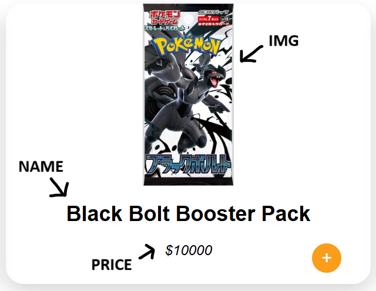
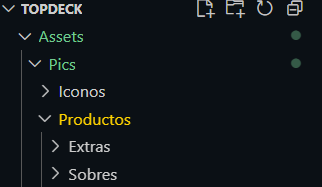

# TOP DECK LANDING PAGE

---

-   Aca dejo una guia detallada de como añadir productos de forma estatica a la pagina para que cualquier colaborador pueda agregar o eliminar productos/extras
-   Cualquier duda que se disponga o se presente se puede consultar al creador del repositorio que estara disponible para agregar/eliminar secciones
-   Todo cambio **comiteado y pusheado** desde el repositorio del GitHub se vera reflejado a los pocos minutos en la pagina hosteada por [Netlify](https://www.netlify.com/)

## Link a la pagina

[Top Deck Importados Langing Page](https://topdeckimportados.netlify.app/)

---

## Guia de para cargar Productos/Extras

⚠️**Respetar al 100** UwU⚠️

Los productos estan guardados en un arreglo de objetos

```js
const products = [{}, {}, {}, {}];
```

```js
const extras = [{}, {}, {}, {}];
```

Los dos arreglos tienen la misma estructura en lo que consta el objeto

```js
{
    id: id_producto,
    name: nombre_producto,
    price: precio_producto,
    img: url_imagen_producto
}
```

donde cada propiedad del objeto representa:



El **id** es algo necesario a la hora de ejecutar el codigo que carga los productos en la pagina y en el carrito de compra, por lo tanto si cargamos un nuevo producto cargarlo por debajo del ultimo y asegurarte de que **el id sea uno mas que el anterior**

El id aparte es un valor numerico, un **int** por lo tanto como JS es un lenguaje de tipado dinamico no se especifica, pero el programa lo entiende porque no lo envolvemos entre comillas dobles (" "), es el unico valor que no va entre comillas dobles en el objeto

_Ejemplo:_

```js
const productos = [
    ...{
        id: 12,
        name: "White Flare",
        price: "10000",
        img: "Assets/Pics/Productos/Sobres/White_Flare_Booster_Pack.webp",
    },
    {
        //Aca empezas a cargar un nuevo producto
        //Como el anterior producto tenia id:12 este va a tener id:13
        id: 13,
        name: "Sobre mega epico",
        price: "$$$",
        img: "Assests/Pics/Productos/Sobres/imagen.webp",
    },
];
```

---

## Como cargar la imagen correctamente

El repositorio tiene una estructura que hay que respetar, sobre todo donde van las imagenes, la imagen la guardamos segun el producto que querramos guardar, sea sobre o algun extra, la direccion donde guardemos la imagen es la misma que ponemos en la propiedad _img_ del objeto



1. Si estamos guardando un **SOBRE** la direccion es en **_Assets/Pics/Productos/Sobres/_**
2. Si estamos guardando un **EXTRA** la direccion es en **_Assets/Pics/Productos/Extras/_**

_Si no se entendio bien en el [productosScripts.js](Assets/Scripts/productsScript.js) estan los productos cargados y se puede guiar de ejemplo del arreglo ya hecho_

---

_Author: [Octavio Noval](https://github.com/OctavioDNoval)_
